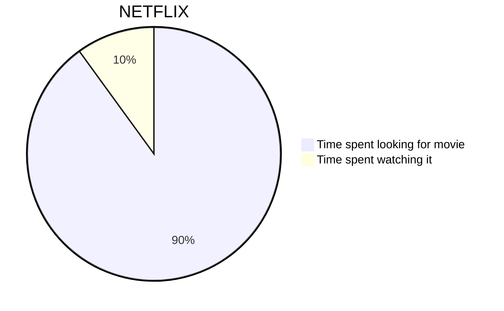
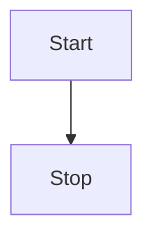
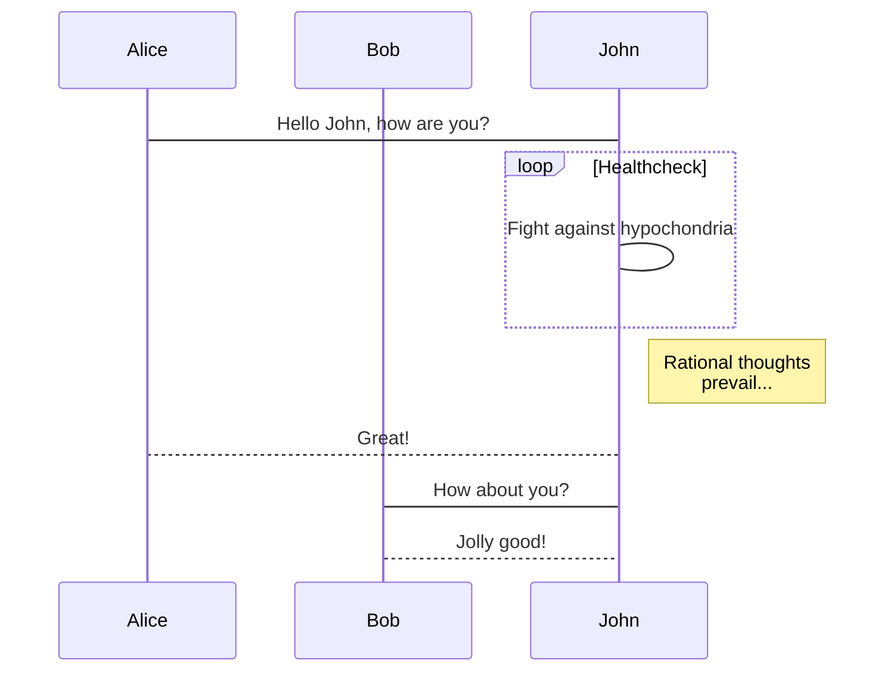
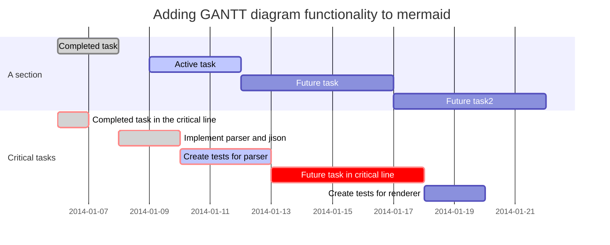
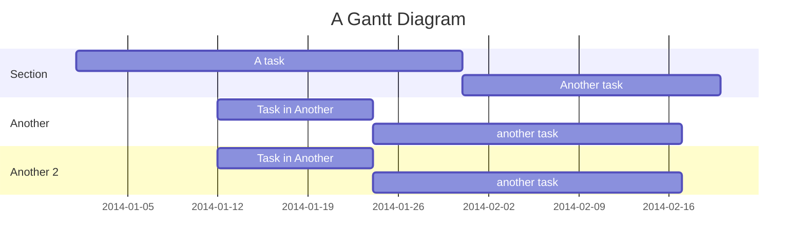

Working with [Markdown files in Visual Studio Code](https://code.visualstudio.com/docs/languages/markdown) is simple, straightforward, and fun. Besides VS Code's basic editing, there are a several Markdown-specific features that help you be more productive.

# Markdown preview

You can also right-click on the editor Tab and select Open Preview (Ctrl+Shift+V) or use the Command Palette (Ctrl+Shift+P) to run the Markdown: **Open Preview to the Side** command (Ctrl+K V).

# Outline view

The Outline view is a separate section in the bottom of the File Explorer. When expanded, it shows the symbol tree of the currently active editor. For Markdown files, the symbol tree is the Markdown file's header hierarchy.

# Extension

- markdownlint
- Markdown All in One
- Markdown Preview Github Styling
- Markdown Preview Enhanced
- Markdown Table Prettifier

# Markdown syntax 

## Bold/Italics

- I just love **bold text**./I just love *bold text*.
- I just love __bold text__./I just love _bold text_.
- Love**is**bold./Love*is*bold

## Blockquotes

> It is Markdown.

> It is also Markdown.
>
> same here.
> > indent
> > > indent

> #### The quarterly results look great!
>
> - Revenue was off the chart.
> - Profits were higher than ever.
>
>  *Everything* is going according to **plan**.

## Lists

1. First item
2. Second item
3. Third item
    1. Indented item
    2. Indented item
4. Fourth item

Or,

- First item
- Second item
- Third item
    - Indented item
    - Indented item
- Fourth item

Or,

1. First item
2. Second item
3. Third item
    - Indented item
    - Indented item
4. Fourth item

## Code and Highlighting

```sh
#!/bin/sh
echo "Hello world"
```

```python
import numpy as np
```

```cpp
#include <iostream>
using namespace std;

int main() {
  cout << "Hello World!";
  return 0;
}
```

```c
#include <stdio.h>
int main() {
   // printf() displays the string inside quotation
   printf("Hello, World!");
   return 0;
}
```

## Table

<https://discourse.devontechnologies.com/t/css-for-markdown-styling-tables/71369>

| Syntax | Description |
| ----------- | ----------- |
| Header | Title |
| Paragraph 1| Text 1|
| Paragraph 2 | Text 2|

| Left-Aligned  | Center Aligned  | Right Aligned |
|:------------- |:---------------:| -------------:|
| Row 1         | Cell 2          | Cell 3        |
| Row 2         | Cell 5          | Cell 6        |
| Row 3         | Cell 8          | Cell 9        |

| Left-Aligned  | Center Aligned  | Right Aligned |
|:------------- |:---------------:| -------------:|
| Row 1         | **Bold**        | Cell 3        |
| Row 2         | *Italic*        | Cell 6        |
| Row 3         | ~~Strike~~      | Cell 9        |
| Row 3         | [Link](dot.com) | Cell 9        |

| <!-- -->      | <!-- -->        | <!-- -->      |
|:-------------:|:---------------:|:-------------:|
| Row 1         | **Bold**        | Cell 3        |
| Row 2         | *Italic*        | Cell 6        |
| Row 3         | ~~Strike~~      | Cell 9        |


```markdown
| Syntax | Description |
| ----------- | ----------- |
| Header | Title |
| Paragraph 1| Text 1|
| Paragraph 2 | Text 2|

| Left-Aligned  | Center Aligned  | Right Aligned |
|:------------- |:---------------:| -------------:|
| Row 1         | Cell 2          | Cell 3        |
| Row 2         | Cell 5          | Cell 6        |
| Row 3         | Cell 8          | Cell 9        |

| Left-Aligned  | Center Aligned  | Right Aligned |
|:------------- |:---------------:| -------------:|
| Row 1         | **Bold**        | Cell 3        |
| Row 2         | *Italic*        | Cell 6        |
| Row 3         | ~~Strike~~      | Cell 9        |
| Row 3         | [Link](dot.com) | Cell 9        |

| <!-- -->      | <!-- -->        | <!-- -->      |
|:-------------:|:---------------:|:-------------:|
| Row 1         | **Bold**        | Cell 3        |
| Row 2         | *Italic*        | Cell 6        |
| Row 3         | ~~Strike~~      | Cell 9        |

```

### Useful link
- [Markdown Table Generator](https://www.tablesgenerator.com/markdown_tables)

## Links

To create a link, enclose the link text in brackets (e.g., [Duck Duck Go]) and then follow it immediately with the URL in parentheses (e.g., (https://duckduckgo.com)).

It is [GNU Compiler Collection (GCC)](https://en.wikipedia.org/wiki/GNU_Compiler_Collection).

## URLs and Email Addresses

<https://www.markdownguide.org>\
<waipangsze@gmail.com>

## Task List

- [x] Write the press release
- [ ] Update the website
- [ ] Contact the media

## Image

1. Open the file containing the Linux.

    

2. Close the file.

## In Fluid theme,

### 便签

可选便签：

- primary
- secondary
- success
- danger
- warning
- info
- light


primary: 文字 或者 `markdown` 均可



secondary: 文字 或者 `markdown` 均可



success: 文字 或者 `markdown` 均可



danger: 文字 或者 `markdown` 均可



warning: 文字 或者 `markdown` 均可



info: 文字 或者 `markdown` 均可



light: 文字 或者 `markdown` 均可


```markdown

primary: 文字 或者 `markdown` 均可

```

## TeXt - Mermaid,

set `mermaid: true`

```
# 流程图，基于 mermaid-js，具体请见：https://hexo.fluid-dev.com/docs/guide/#mermaid-流程图
# Flow chart, based on mermaid-js, see: https://hexo.fluid-dev.com/docs/en/guide/#mermaid
mermaid:
# 开启后文章默认可用，自定义页面如需使用，需在 Front-matter 中指定 `mermaid: true`
# If you want to use mermaid on the custom page, you need to set `mermaid: true` in Front-matter
enable: false
```

and,

```sh
npm install hexo-filter-mermaid-diagrams
```





### Flowchart


    ```mermaid
    graph TD;
        A-->B;
        A-->C;
        B-->D;
        C-->D;
    ```

### Sequence Diagram



    ```mermaid
    sequenceDiagram
        participant Alice
        participant Bob
        Alice->John: Hello John, how are you?
        loop Healthcheck
            John->John: Fight against hypochondria
        end
        Note right of John: Rational thoughts <br/>prevail...
        John-->Alice: Great!
        John->Bob: How about you?
        Bob-->John: Jolly good!
    ```

### Gant Diagrams



    ```mermaid
    gantt
        dateFormat  YYYY-MM-DD
        title Adding GANTT diagram functionality to mermaid
        section A section
            Completed task            :done,    des1, 2014-01-06,2014-01-08
            Active task               :active,  des2, 2014-01-09, 3d
            Future task               :         des3, after des2, 5d
            Future task2              :         des4, after des3, 5d
        section Critical tasks
            Completed task in the critical line :crit, done, 2014-01-06,24h
            Implement parser and jison          :crit, done, after des1, 2d
            Create tests for parser             :crit, active, 3d
            Future task in critical line        :crit, 5d
            Create tests for renderer           :2d
    ```



    ```mermaid
    gantt
        title A Gantt Diagram
        dateFormat YYYY-MM-DD
        section Section
            A task          :a1, 2014-01-01, 30d
            Another task    :after a1, 20d
        section Another
            Task in Another :2014-01-12, 12d
            another task    :24d
        section Another 2
            Task in Another :2014-01-12, 12d
            another task    :24d
    ```

## Math block

set\
`mathjax: true`\
`mathjax_autoNumber: true`
{:.info}

### In TeXt theme, MathJax is used.

1. [MathJax 語法補帖](https://nightcatv.github.io/2020/06/05/MathJax%20%E8%AA%9E%E6%B3%95%E8%A3%9C%E5%B8%96/#MathJax-%E8%AA%9E%E6%B3%95%E8%A3%9C%E5%B8%96)
2. [MathJax 语法快速指南](https://bachzart.github.io/2020/09/17/MathJax-%E8%AF%AD%E6%B3%95%E5%BF%AB%E9%80%9F%E6%8C%87%E5%8D%97/)

edit waipangsze.github.io/_includes/markdown-enhancements/mathjax.html and add

```
displayMath: [ ['$$','$$'], ['\\[','\\]'] ]
```

and,

```
<script type="text/x-mathjax-config">
	var _config = { tex2jax: {
        inlineMath: [ ['$','$'], ['\\(','\\)'] ],
        displayMath: [ ['$$','$$'], ['\\[','\\]'] ]
	}};
	_config.TeX = { equationNumbers: { autoNumber: "all" } };
	MathJax.Hub.Config(_config);
</script>
<script type="text/javascript" src="https://cdn.bootcss.com/mathjax/2.7.4/MathJax.js?config=TeX-MML-AM_CHTML" async></script>
```

Inline math: $x^2$

$$
\left( \sum_{k=1}^n a_k b_k \right)^2
\leq
\left( \sum_{k=1}^n a_k^2 \right)
\left( \sum_{k=1}^n b_k^2 \right)
$$

$$
a+1 = b\\
c+2 = d 
$$

$$
\begin{align}
a &= 1 \\
b &= 2 
\end{align}
\tag{1}
$$

$$
\begin{equation}
\begin{split}
A & = \frac{\pi r^2}{2} \\
    & = \frac{1}{2} \pi r^2
\end{split}
\end{equation}
\tag{2}
$$

$$
\begin{align*}
  & \phi(x,y) = \phi \left(\sum_{i=1}^n x_ie_i, \sum_{j=1}^n y_je_j \right)
  = \sum_{i=1}^n \sum_{j=1}^n x_i y_j \phi(e_i, e_j) = \\
  & (x_1, \ldots, x_n) \left( \begin{array}{ccc}
      \phi(e_1, e_1) & \cdots & \phi(e_1, e_n) \\
      \vdots & \ddots & \vdots \\
      \phi(e_n, e_1) & \cdots & \phi(e_n, e_n)
    \end{array} \right)
  \left( \begin{array}{c}
      y_1 \\
      \vdots \\
      y_n
    \end{array} \right)
\end{align*}
\tag{3}
$$

$$
a = 1 \\
b + 1 = 2 \\
c + 1 + 2 = 3
$$

$$
\begin{cases}
a_1x + b_1y + c_1z = d_1\\
a_2x + b_2y + c_2z = d_2\\
a_3x + b_3y + c_3z = d_3\\
\end{cases}
$$


